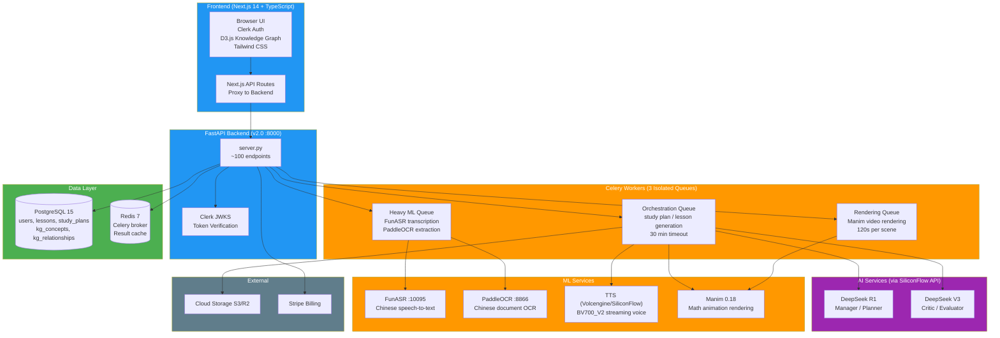
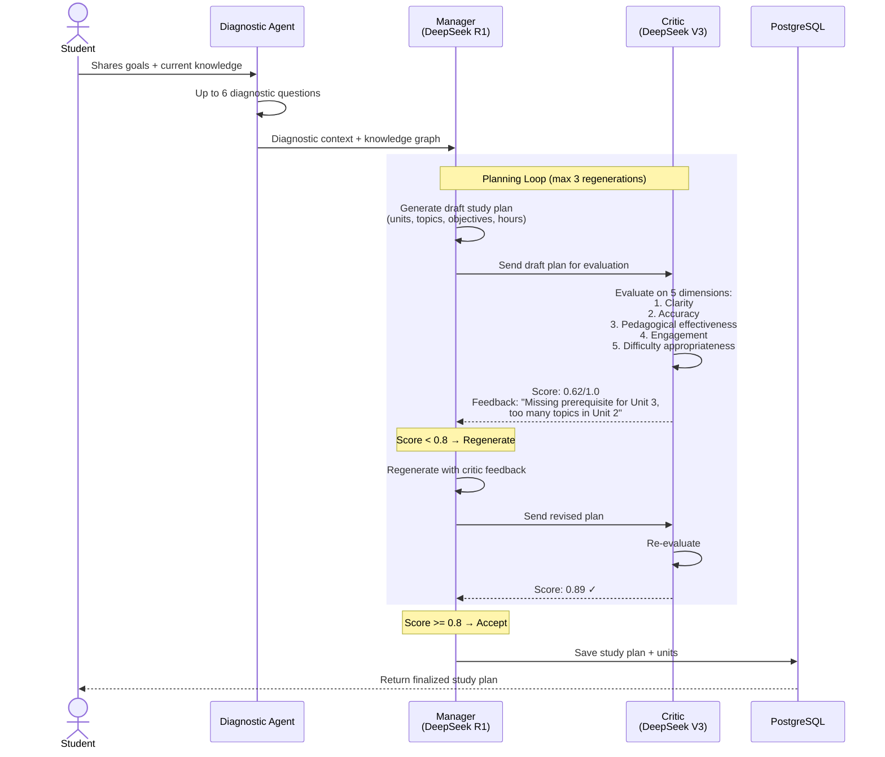
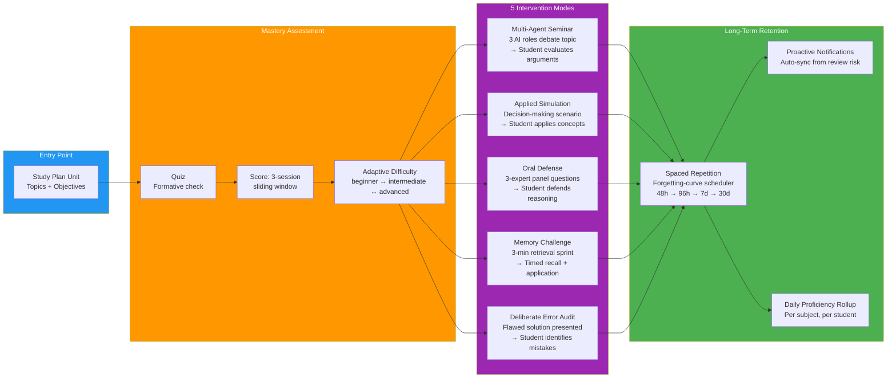

# MentorMind Presentation — AI Prompt Package

Copy each section below into the corresponding AI tool. No coding required.

---

## 1. SLIDE CONTENT PROMPT (for Gamma.app, Beautiful.ai, Canva AI, or any AI slide generator)

Paste this entire block into your AI presentation tool:

```
Create a 10-slide presentation for my senior project "MentorMind: AI-Powered Personalized Study Plans for Chinese Students".

Use a professional dark blue and white color scheme. Each slide should have a title and 3–4 short bullet points.

SLIDE 1 — TITLE SLIDE
Title: "MentorMind: AI-Powered Personalized Study Plans for Chinese Students"
Subtitle: "Senior Project Presentation"
Bullets:
- Transform passive learning into active mastery
- AI that adapts to how you learn, not what you study
- Built for 4 languages: Chinese, English, Japanese, Korean

SLIDE 2 — THE PROBLEM
Title: "The Problem"
Bullets:
- 46M+ Chinese students in exam-track education
- One-size-fits-all tutoring ignores individual gaps
- Gaokao prep costs families $2,000–$15,000/year
- Teachers can't diagnose 50+ students per class

SLIDE 3 — SOLUTION OVERVIEW
Title: "Solution Overview"
Bullets:
- Conversational diagnostic finds your real gaps
- Per-user knowledge graph maps concept dependencies
- AI planner generates adaptive study plans
- Process-first engine: 5 interactive learning modes

SLIDE 4 — SYSTEM ARCHITECTURE
Title: "System Architecture"
Bullets:
- Next.js 14 frontend with Clerk auth and D3.js graphs
- FastAPI backend with 3 isolated Celery worker queues
- PostgreSQL + Redis for data and job orchestration
- SiliconFlow API: DeepSeek R1 (manager) + V3 (critic)
[DIAGRAM PLACEHOLDER — insert architecture diagram here]

SLIDE 5 — MULTIMODAL INPUT & KNOWLEDGE GRAPH
Title: "Multimodal Input & Knowledge Graph"
Bullets:
- Audio upload → FunASR → Chinese transcript
- Image upload → PaddleOCR → extracted text
- LLM extracts concepts → per-user knowledge graph
- D3.js force graph: prerequisite chains, mastery colors
[DIAGRAM PLACEHOLDER — insert knowledge graph image here]

SLIDE 6 — MANAGER-CRITIC AI PLANNING LOOP
Title: "Manager-Critic AI Planning Loop"
Bullets:
- DeepSeek R1 (manager) drafts the study plan
- DeepSeek V3 (critic) scores on 5 quality dimensions
- Score < 0.8 → critic sends feedback, manager regenerates
- Score ≥ 0.8 → plan saved and delivered to student
[DIAGRAM PLACEHOLDER — insert manager-critic loop diagram here]

SLIDE 7 — PROCESS-FIRST LEARNING ENGINE
Title: "Process-First Learning Engine"
Bullets:
- Seminar: 3 AI roles debate a topic, you judge
- Simulation: apply concepts to a decision scenario
- Oral Defense: 3-expert panel quizzes your reasoning
- Memory Challenge + Error Audit for retrieval practice
[DIAGRAM PLACEHOLDER — insert process flow diagram here]

SLIDE 8 — CHALLENGES & THE PIVOT
Title: "Challenges & The Pivot"
Bullets:
- Original plan: AI-generated educational videos with Manim
- Week 4 pivot: video pipeline hidden, refocused on study plans
- CJK font rendering in math animations was unreliable
- Built API resilience: circuit breaker, multi-provider fallback

SLIDE 9 — RESULTS & METRICS
Title: "Results & Metrics"
Bullets:
- API v2.0 — ~100 endpoints, 4 languages supported
- $0.001–$0.002/K tokens → ~$160/month operating budget
- Adaptive difficulty from 3-score sliding window
- Spaced review scheduler, 90-day telemetry, daily rollups

SLIDE 10 — FUTURE WORK & THANK YOU
Title: "Future Work & Thank You"
Bullets:
- Restore video generation with fixed CJK Manim pipeline
- Mobile app with offline study plan access
- LMS integration for school deployment
- Expand subjects beyond STEM into humanities

Make each slide clean with large readable text. Leave rectangular placeholders on slides 4, 5, 6, 7 for diagrams.
```

---

## 2. DIAGRAM GENERATION PROMPTS

### Diagram A: System Architecture (Mermaid Flowchart)

Go to https://mermaid.live. Paste this code and export as PNG:



→ Save as PNG. Insert into **Slide 4**.

---

### Diagram B: Manager-Critic Sequence Diagram

Go to https://mermaid.live. Paste this code and export as PNG:



→ Save as PNG. Insert into **Slide 6**.

---

### Diagram C: Process-First Learning Engine

Go to https://mermaid.live. Paste this code and export as PNG:



→ Save as PNG. Insert into **Slide 7**.

---

### Diagram D: Knowledge Graph Image

This one is already generated as a PNG: `presentation/diagrams/knowledge_graph.png`

It's a dark-themed NetworkX force-directed graph showing Chinese math concepts (一元二次方程, 因式分解, etc.) with colored nodes (green = mastered, yellow = learning, red = struggling) and styled edges (solid = prerequisite, dashed = contains, dotted = related).

→ Insert this PNG directly into **Slide 5**.

If you want to regenerate it or customize it, run:

```bash
python3 presentation/diagrams/generate_knowledge_graph.py
```

---

## 3. SPEAKER NOTES (for reference during presentation)

Don't paste these into the AI slide tool — keep them open on a second screen or print them.

### Slide 1 — Title (60s)
Good morning everyone. Today I'm presenting MentorMind — an AI-powered platform that creates personalized study plans for Chinese students. Over 6 weeks, I built a full-stack application that diagnoses a student's knowledge gaps, builds a concept knowledge graph, and generates adaptive study plans with interactive learning modes. This isn't just a content generator — it's a process-first learning engine that simulates the experience of having a personal tutor.

### Slide 2 — Problem (60s)
China has over 46 million students in exam-track education. Private tutoring is a massive market, but it's expensive and still one-size-fits-all. A teacher with 50 students can't deeply diagnose each student's specific gaps. Students waste time re-learning what they already know while their real weaknesses go unaddressed. MentorMind solves this through an AI that does three things: diagnoses gaps through conversation, maps knowledge dependencies in a graph, and generates adaptive plans that target what each student actually needs.

### Slide 3 — Solution (75s)
First, the student has a conversation with our AI diagnostic agent — it asks targeted questions to uncover what they actually know versus what they think they know. Those results feed into a personal knowledge graph that maps how concepts relate. The AI planner then generates a structured study plan with units, objectives, and difficulty calibrated to the student's level. But here's what makes MentorMind unique: we don't just hand you a reading list. Our process-first learning engine offers five distinct interaction modes — seminar debates, applied simulations, oral defenses, memory challenges, and error audits — each triggered based on your mastery level.

### Slide 4 — Architecture (75s)
The frontend is Next.js 14 with Clerk for authentication. The knowledge graph visualization uses D3.js. The backend is FastAPI version 2.0 with about 100 endpoints. Heavy work goes to three isolated Celery queues — orchestration, rendering, and heavy ML — so a long video render never blocks a study plan generation. We use PostgreSQL 15 for all persistent data including the knowledge graph tables, and Redis 7 as the message broker. All AI calls go through SiliconFlow's API at $0.001 per thousand tokens. We use R1 for planning and V3 for critique — a manager-critic architecture I'll detail next.

### Slide 5 — Multimodal + KG (75s)
Students can upload audio and images. Our audio pipeline uses Alibaba's FunASR, a Chinese-optimized speech recognition model. For images we use Baidu's PaddleOCR, trained for Chinese document text. Both feeds go through an LLM concept extractor that pulls out key topics and relationships, stored in our knowledge graph — two PostgreSQL tables for nodes and edges. The graph is per-user and per-language. On the frontend, we render this with D3.js as an interactive force-directed graph where nodes are colored by mastery level.

### Slide 6 — Manager-Critic Loop (75s)
When a student's diagnostic results are ready, DeepSeek R1 acts as the manager: it generates a draft study plan with units, topics, and objectives. Before that plan reaches the student, DeepSeek V3 acts as the critic: it evaluates on 5 dimensions — clarity, accuracy, pedagogical effectiveness, engagement, and difficulty appropriateness. If the score is below 0.8, the critic sends feedback and the manager regenerates — up to three cycles. If the score meets the threshold, the plan is saved and presented to the student. This loop is implemented in our agentic.py module with specialized subagents for producing quizzes, flashcards, and formula sheets.

### Slide 7 — Process-First Engine (75s)
This is what sets MentorMind apart. Reading is passive — real learning happens when you engage. We have five modes: Multi-Agent Seminar where three AI roles debate and you judge. Applied Simulation where you solve a decision scenario. Oral Defense where a panel of expert agents quizzes your reasoning. Memory Challenge — a three-minute retrieval sprint. And Deliberate Error Audit where you find flaws in a wrong solution. All backed by a spaced repetition scheduler that uses a forgetting-curve algorithm to determine when you need to review each concept, with proactive notifications when you're at risk of forgetting.

### Slide 8 — Challenges & Pivot (75s)
The original vision was AI-generated educational videos using Manim — the same engine 3Blue1Brown uses. We built a full 6-stage video pipeline. But by week 4, we hit a wall: CJK font rendering in Manim was inconsistent, and user research showed students wanted personalized guidance more than polished videos. So we pivoted. We hid the video frontend, kept the pipeline ready for future restoration, and redirected all effort to the study plan system. The pivot also taught us about API resilience — we built a circuit breaker with exponential backoff and multi-provider fallback.

### Slide 9 — Results & Metrics (60s)
The API is at version 2.0 with about 100 endpoints covering lesson generation, study plans, knowledge graphs, Gaokao prep, board lessons, billing, analytics, and telemetry. Four languages supported with full UI and content localization. Operating cost is about $160 per month at $0.001 per thousand tokens. The adaptive difficulty system uses a sliding window of the last three quiz scores. The spaced repetition scheduler starts reviews at 48 hours. We track everything with a 90-day telemetry retention system and run daily proficiency rollups. We also have a complete Gaokao exam preparation system.

### Slide 10 — Future & Thanks (60s)
Four priorities. First, restore video generation once we solve CJK font rendering in Manim. Second, build a mobile app with offline study plan access. Third, integrate with school learning management systems. Fourth, expand beyond STEM into humanities. Thank you — I'm happy to take questions. Let me show you a quick demo first.

---

## 4. DEMO SCRIPT (3 minutes)

### Pre-Demo Setup (5 min before)
- [ ] Server + frontend running
- [ ] Logged in via Clerk
- [ ] Browser tabs pre-opened: `/study-plan`, `/knowledge-graph`, `/analytics`
- [ ] Have a screenshot image ready (e.g., math worksheet photo)
- [ ] **Backup**: pre-recorded demo video ready if live fails

### Step 1: Study Plan Creation (60s)
**Page:** `/study-plan`
1. Type: "I'm preparing for my Gaokao math exam. I struggle with quadratic functions."
2. System asks diagnostic questions (up to 6). Answer 2–3.
3. System generates structured plan with units and estimated hours.
> **Say:** "The diagnostic agent adapts based on previous answers using Bayesian confidence analysis."

### Step 2: Knowledge Graph (45s)
**Page:** `/knowledge-graph`
1. Show the D3.js force-directed graph with colored nodes.
2. Point out: green = mastered, yellow = learning, red = struggling.
> **Say:** "This graph is built incrementally from every lesson the student completes. Red nodes are what the planner prioritizes."

### Step 3: Study Plan Detail (45s)
**Page:** `/study-plan/[id]`
1. Show unit list with progress indicators.
2. Expand a unit: study guide with KaTeX math, quiz, flashcards, formula sheet.
> **Say:** "Quiz scores feed into adaptive difficulty — a sliding window of three scores auto-adjusts the next unit."

### Step 4: Board Lesson or Analytics (30s)
**Page:** `/board/[sessionId]` or `/analytics`
Quickly show the streaming board lesson (WebSocket + TTS) or the analytics dashboard with proficiency rollups.

**If anything fails:** Switch to backup video and narrate over it.

---

## 5. Q&A PREP (15 questions)

### Technical (5)

**Q1: Why DeepSeek instead of GPT-4?**
30x cheaper ($0.001 vs $0.03 per 1K tokens). DeepSeek V3 excels at Chinese language tasks and structured content. Multi-provider fallback built in if SiliconFlow has downtime.

**Q2: How do you handle FunASR transcription errors?**
Paraformer model pre-trained on Mandarin across accents. Whisper fallback for English. LLM concept extractor corrects minor errors contextually.

**Q3: What's the quality threshold for the manager-critic loop?**
0.8 (80%). Below 0.8 = significant issues (missing prerequisites, bad sequencing). Capped at 3 regeneration cycles to prevent infinite loops. Dimensions: clarity, accuracy, pedagogical effectiveness, engagement, difficulty appropriateness.

**Q4: How does adaptive difficulty work?**
Sliding window of last 3 quiz scores. >85% average → difficulty increases. <60% → decreases. 60-85% → stays. Affects quiz complexity, study guide depth, and recommended learning modes.

**Q5: How did you solve CJK rendering in Manim?**
Partially. Installed texlive-lang-chinese for LaTeX. Simple formulas work. Complex mixed CJK + math was inconsistent — that's one reason for the pivot.

### Business (4)

**Q6: Breakdown of $160/month cost?**
~$100 AI API calls (SiliconFlow), ~$30 TTS synthesis (Volcengine), ~$30 cloud hosting (Alibaba ECS HK). $0.05/day per active student.

**Q7: Target customer and monetization?**
Chinese middle/high school students preparing for Gaokao + international exams. Parents currently pay $2K-$15K/year for tutoring. Stripe billing integrated. Target <$10/month subscription.

**Q8: Break-even on $10/month?**
~16 subscribers for direct costs. One server handles ~50 concurrent users. Docker Compose makes horizontal scaling straightforward.

**Q9: Competitors?**
Khan Academy/Coursera = content, no personalization. Yuanfudao/Zuoyebang = live tutoring, expensive. Duolingo = gamification, no STEM depth. We sit at the intersection: AI personalization at content prices.

### Methodology (3)

**Q10: How do you validate pedagogical quality?**
Manager-critic loop (auto-scoring), content validator (completeness checks), student feedback surveys (PMF/NPS). Formal A/B testing planned for next phase.

**Q11: The pivot — failure or strategy?**
Strategic adjustment. Video pipeline worked but wasn't production-consistent. Pivot let us deliver in 6 weeks vs months of font fixes. Pipeline code intact for future restoration.

**Q12: Data privacy for Chinese students?**
All data on our own infrastructure. Stateless AI API calls. Clerk JWKS — no stored passwords. PIPL-compatible single-tenant architecture.

### Future (3)

**Q13: Mobile app plan?**
React Native sharing TypeScript types from Next.js. Offline study plans, push notifications for spaced repetition, camera OCR. Q4 prototype.

**Q14: LMS integration?**
LTI 1.3 for Canvas, Moodle, Chaoxing. Teacher assigns plans as homework, scores sync to gradebook. Start with Canvas (cleanest LTI). Q1 next year.

**Q15: Subject expansion beyond STEM?**
History: chronological knowledge graphs. Literature: character/theme relationships. Core pipeline is subject-agnostic. Main work: subject-specific prompt templates. Q2 next year.

### Tricky Comebacks

**"This seems like a ChatGPT wrapper."**
> ChatGPT doesn't build a persistent knowledge graph, track spaced repetition, or run a manager-critic quality loop. Our value is the structured learning infrastructure.

**"How do you know students learn?"**
> We track engagement metrics, quiz scores, spaced repetition completion, and proficiency rollups. Formal pre/post test studies are planned for validation.

**"What if the AI generates wrong content?"**
> Manager-critic catches structural issues. We communicate that the AI is a study aid, not an authoritative source. Gaokao content uses verified exam frameworks as grounding.

---

## 6. QUICK REFERENCE: KEY NUMBERS

| Metric | Value |
|--------|-------|
| API version | 2.0.0 |
| Endpoints | ~100 |
| Languages | zh, en, ja, ko |
| DeepSeek cost | $0.001/K (V3), $0.002/K (R1) |
| Monthly budget | ~$160 |
| Quality threshold | 0.8 (80%) |
| Max critic retries | 3 |
| Diagnostic turns | max 6 |
| Quiz score window | last 3 scores |
| Difficulty levels | beginner / intermediate / advanced |
| Spaced review start | 48 hours |
| Telemetry retention | 90 days |
| Celery queues | 3 (orchestration, rendering, heavy ML) |
| Dev timeline | 6 weeks (pivoted week 4) |

---

## 7. EXECUTION ORDER

| Step | Action | Time |
|------|--------|------|
| 1 | Paste Slide Content Prompt (#1 above) into Gamma.app / Beautiful.ai / Canva AI | 5 min |
| 2 | Copy Diagram A Mermaid code → mermaid.live → export PNG → insert Slide 4 | 10 min |
| 3 | Copy Diagram B Mermaid code → mermaid.live → export PNG → insert Slide 6 | 5 min |
| 4 | Copy Diagram C Mermaid code → mermaid.live → export PNG → insert Slide 7 | 5 min |
| 5 | Insert `diagrams/knowledge_graph.png` → Slide 5 | 2 min |
| 6 | Review slides, adjust fonts/layout | 10 min |
| 7 | Rehearse with speaker notes (#3) | 20 min |
| 8 | Test demo flow (#4) | 15 min |
| 9 | Review Q&A (#5) | 15 min |
| **Total** | | **~1.5 hours** |
