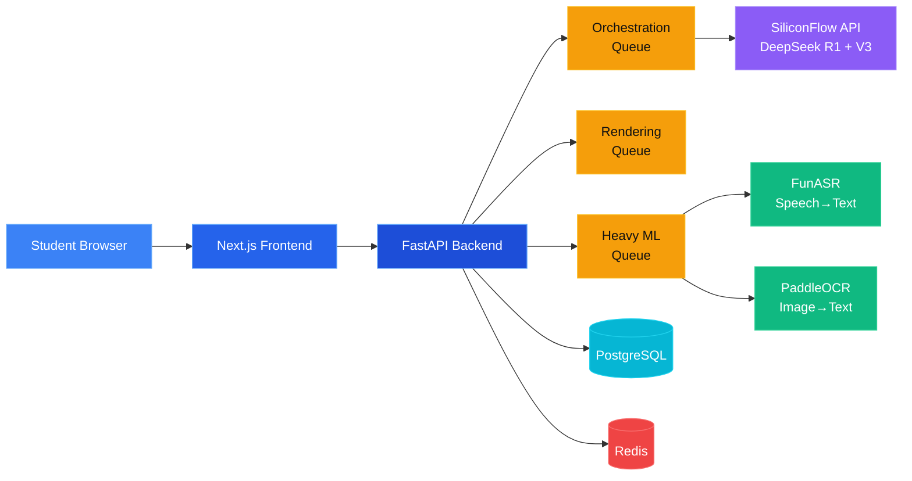

# System Architecture (Presentation-ready Mermaid)

```mermaid
flowchart LR
    U[Student Browser] --> N[Next.js Frontend]
    N --> F[FastAPI Backend]

    F --> Q1[Orchestration<br/>Queue]
    F --> Q2[Rendering<br/>Queue]
    F --> Q3[Heavy ML<br/>Queue]

    Q1 --> AI[SiliconFlow API<br/>DeepSeek R1 + V3]
    Q3 --> ASR[FunASR<br/>Speech→Text]
    Q3 --> OCR[PaddleOCR<br/>Image→Text]

    F --> DB[(PostgreSQL)]
    F --> R[(Redis)]

    style U fill:#3B82F6,color:#fff,stroke:#60A5FA
    style N fill:#2563EB,color:#fff,stroke:#60A5FA
    style F fill:#1D4ED8,color:#fff,stroke:#60A5FA
    style Q1 fill:#F59E0B,color:#111,stroke:#FBBF24
    style Q2 fill:#F59E0B,color:#111,stroke:#FBBF24
    style Q3 fill:#F59E0B,color:#111,stroke:#FBBF24
    style AI fill:#8B5CF6,color:#fff,stroke:#A78BFA
    style ASR fill:#10B981,color:#fff,stroke:#34D399
    style OCR fill:#10B981,color:#fff,stroke:#34D399
    style DB fill:#06B6D4,color:#fff,stroke:#22D3EE
    style R fill:#EF4444,color:#fff,stroke:#F87171
```
