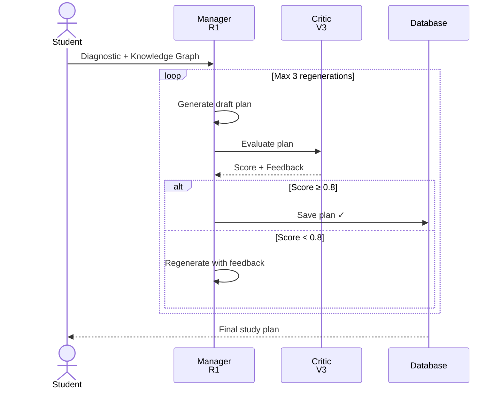

# Manager-Critic Loop (Presentation-ready Mermaid)

```mermaid
sequenceDiagram
    actor S as Student
    participant M as Manager<br/>R1
    participant C as Critic<br/>V3
    participant D as Database

    S->>M: Diagnostic + Knowledge Graph
    loop Max 3 regenerations
        M->>M: Generate draft plan
        M->>C: Evaluate plan
        C-->>M: Score + Feedback
        alt Score ≥ 0.8
            M->>D: Save plan ✓
        else Score < 0.8
            M->>M: Regenerate with feedback
        end
    end
    D-->>S: Final study plan
```
