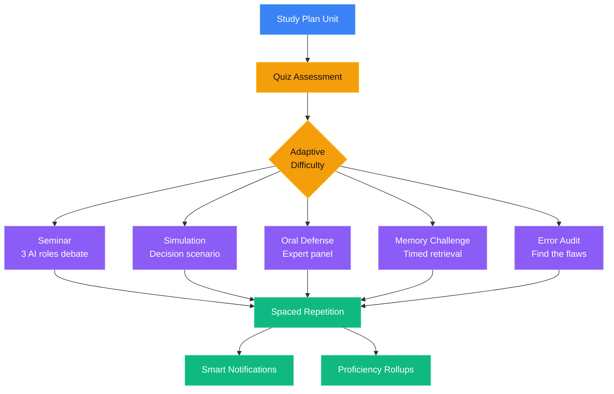

# Process-First Learning Engine (Presentation-ready Mermaid)

```mermaid
flowchart TD
    P[Study Plan Unit] --> Q[Quiz Assessment]
    Q --> A{Adaptive<br/>Difficulty}
    
    A --> M1[Seminar<br/>3 AI roles debate]
    A --> M2[Simulation<br/>Decision scenario]
    A --> M3[Oral Defense<br/>Expert panel]
    A --> M4[Memory Challenge<br/>Timed retrieval]
    A --> M5[Error Audit<br/>Find the flaws]

    M1 --> S[Spaced Repetition]
    M2 --> S
    M3 --> S
    M4 --> S
    M5 --> S

    S --> N[Smart Notifications]
    S --> R[Proficiency Rollups]

    style P fill:#3B82F6,color:#fff,stroke:#60A5FA
    style Q fill:#F59E0B,color:#111,stroke:#FBBF24
    style A fill:#F59E0B,color:#111,stroke:#FBBF24
    style M1 fill:#8B5CF6,color:#fff,stroke:#A78BFA
    style M2 fill:#8B5CF6,color:#fff,stroke:#A78BFA
    style M3 fill:#8B5CF6,color:#fff,stroke:#A78BFA
    style M4 fill:#8B5CF6,color:#fff,stroke:#A78BFA
    style M5 fill:#8B5CF6,color:#fff,stroke:#A78BFA
    style S fill:#10B981,color:#fff,stroke:#34D399
    style N fill:#10B981,color:#fff,stroke:#34D399
    style R fill:#10B981,color:#fff,stroke:#34D399
```
